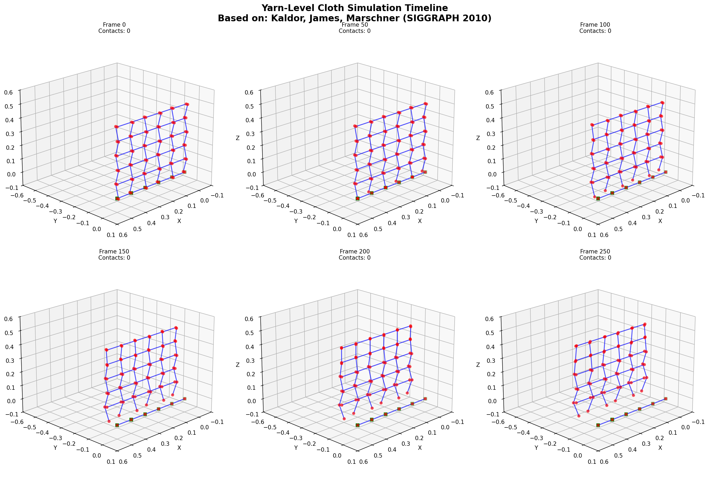

## Overview

This project develops a multi-scale cloth simulation approach that combines real-time coarse physics simulation with learned yarn-level geometric details. By training neural networks to predict fine-scale displacement fields and reconstructing them using parametric surface patches, we achieve physically plausible cloth with yarn-level detail at interactive frame rates.

---
<!-- Project Proposal -->

<strong>Project Proposal</strong>

### Problem Statement

Current cloth simulation methods face a fundamental trade-off between performance and detail:

- **Coarse-resolution simulations** achieve real-time performance but lack fine geometric details like yarn-level wrinkles and fabric microstructure
- **High-resolution simulations** capturing yarn dynamics are computationally prohibitive for interactive applications  
- **Existing wrinkle synthesis techniques** add visual detail but often lack physical accuracy and fail to capture complex mechanical behavior of fabric microstructure

### Motivation

Physically accurate, real-time cloth simulation with fine detail is critical for:

- Virtual try-on systems and digital fashion design
- Video games and VR/AR environments
- Film production and visual effects
- Material science and textile engineering research

The ability to simulate yarn-level fabric behavior in real-time would enable more realistic virtual garments and improve the quality of interactive design tools.

---

### Proposed Approach

A three-level geometric learning framework combining coarse physics simulation with learned yarn-level dynamics:

- **Coarse Level:** Leverage existing real-time physics simulators (XPBD, Position-Based Dynamics) for low-resolution cloth mesh
- **Fine Level:** Train neural networks to predict yarn-level displacement fields as functions of coarse mechanical features (strain tensors, curvature, stretch)
- **Reconstruction Level:** Apply parametric surface interpolation (Coons patches) to reconstruct high-resolution cloth by composing coarse geometry with learned fine displacements

**Key Insight:** Coarse simulation produces locally smooth 2D parametric surfaces that serve as a geometric canvas for fine details, enabling efficient learned detail synthesis while preserving physics.

---

### Novelty

- **Geometric reconstruction framework:** Formulating fine detail prediction as learning displacement fields in parametric patch coordinates with Coons-based C0/C1 continuous reconstruction
- **Physics-informed representation:** Learning yarn dynamics conditioned on physically meaningful coarse features rather than purely data-driven synthesis
- **Unified multi-scale approach:** Tight integration between classical physics simulation and learned mechanics through principled geometric interface

---

### Relationship to Geometric Modeling

This work fundamentally addresses geometric modeling at multiple scales by:

- Leveraging classical surface representations (parametric patches, ruled surfaces)
- Developing geometric interpolation schemes for multi-resolution reconstruction
- Learning mappings between geometric and mechanical features at different scales

The parametric surface framework provides the mathematical structure connecting coarse and fine geometry.

---

### Project Milestones

**Phase 1: Foundation & Literature Review**

- Survey state-of-the-art cloth simulation methods (PBD, XPBD, FEM-based)
- Review neural cloth simulation and learning-based wrinkle synthesis
- Study parametric surface reconstruction techniques (Coons patches, subdivision surfaces, displacement mapping)
- Research yarn-level fabric mechanics and multi-scale textile simulation
- Implement baseline coarse cloth simulator using existing framework

**Phase 2: Core Development**

- Generate training dataset: High-resolution yarn-level cloth simulations (hanging cloth, draping scenarios)
- Design neural architecture for predicting yarn displacement fields from coarse features
- Implement and train initial model
- Develop Coons patch reconstruction module for geometric interpolation
- Perform preliminary qualitative evaluation against ground truth

**Phase 3: Integration & Evaluation**

- Complete end-to-end pipeline integrating coarse simulation, learned prediction, and geometric reconstruction
- Achieve real-time or near-real-time performance
- Develop interactive demo
- Quantitative evaluation:
  - Geometric error metrics (vertex position error, normal deviation)
  - Physical plausibility (strain energy comparison)
  - Performance benchmarks (FPS, inference time)

**Stretch Goals**

- Generalization across different draping scenarios and fabric types
- Handle challenging cases (sharp folds, self-contact with fine details)

<!-- Literature Review -->

<strong>Literature Review</strong>

### Neural Cloth Simulation and Learning-Based Wrinkle Synthesis

1. **[Animation Wrinkling: Augmenting Coarse Cloth Simulations with Realistic-Looking Wrinkles](https://dl.acm.org/doi/10.1145/1882261.1866183)**

Combines coarse cloth animation with curve-based realistic wrinkles generation. Uses stretch tensor of coarse animation as guide for wrinkle placement but lacks physical accuracy due to limitation of information on the way real cloth wrinkles move and deform.

2. **[Example-Based Wrinkle Synthesis for Clothing Animation](http://graphics.berkeley.edu/papers/Wang-EBW-2010-07/Wang-EBW-2010-07.pdf)**

Uses precomputed databases from high-resolution simulations across pose ranges for wrinkle synthesis. Employs mesh interpolation to combine multiple joint influences with coarse simulation at interactive rates. Does not apply to loosely-fit clothing such as skirts and capes. The method also have limited generalizability to different garment types.

3. **[Physics-Inspired Upsampling for Cloth Simulation in Games](https://users.cs.utah.edu/~ladislav/kavan11physics/kavan11physics.pdf)**

Develops linear upsampling operators for physically-based cloth simulation to enrich coarse meshes with mid-scale details. Designed for minimal time and memory budgets suitable for real-time game applications. It's context-specific and cannot handle complex nonlinear dynamics.

4. **[Hierarchical Cloth Simulation using Deep Neural Networks](https://arxiv.org/abs/1802.03168)**

Combines conventional physically-based simulation at coarse levels with DNN-generated detailed levels. Demonstrates reliable and fast cloth simulation through hierarchical processing. Requires numerous DNN for multiple hierarchies. May introduce artifacts under special cases.

5. **[Wrinkle Synthesis for Cloth Mesh with Hermite Radial Basis Functions](https://link.springer.com/article/10.1007/s11042-020-09743-3)**

Uses Hermite Radial Based Functions to reconstruct clothing mesh approximations, tracing spatially and temporally coherent wrinkle curves. Generates plausible wrinkle geometry using implicit deformers. Needs mesh partitioning and can't extend to open cloth meshes.

6. **[Multi-feature Super-Resolution Network for Cloth Wrinkle Synthesis](https://link.springer.com/article/10.1007/s11390-021-1331-y)**

Develops MFSR networks that synthesize high-resolution cloth animation from paired low-resolution and high-solution training data. Achieves 12-14 times faster performance than traditional physical simulation while maintaining realistic wrinkle details through multi-feature processing. Generalizes to novel gestures but not to different meshes.

7. **[GPU-based Simulation of Cloth Wrinkles at Submillimeter Levels](https://dl.acm.org/doi/10.1145/3450626.3459787)**

Formulates nonlinear optimization problems for simulating high-resolution, quasistatic wrinkles using block-based descent methods. Achieves submillimeter detail levels with millions of vertices through GPU acceleration.

8. **[Learning Mesh-Based Simulation with Graph Networks](https://arxiv.org/abs/2010.03409)**

Introduces framework for learning mesh-based simulations using graph neural networks that pass messages on mesh graphs. Demonstrates accurate prediction of cloth dynamics with adaptive mesh discretization and resolution-independent learning.

9. **[Neural Cloth Simulation](https://arxiv.org/abs/2212.11220)**

General framework for realistic cloth animation through unsupervised deep learning. The architecture automatically disentangles static and dynamic cloth subspaces, enabling novel motion augmentation techniques for improved generalization. Traditional cloth self-collision handling using previous states info is incompatible with neural approach.

10. **[MeshGraphNetRP: Improving Generalization of GNN-based Cloth Simulation](https://lava.kaist.ac.kr/wp-content/uploads/2024/02/MeshGraphNetRP.pdf)**

Enhances GNN models with RNN-based state encoding and physics-informed features for complex cloth movement. Shows improved accuracy and generalization. Sacrifices the capability of interactions with surroundings and generalization to novel rest states.

11. **[A Physics-embedded Deep Learning Framework for Cloth Simulation](https://arxiv.org/abs/2403.12820)**

Proposes a physics-embedded learning framework that directly encodes physical features of cloth simulation using CNNs to represent spatial correlations of mass-spring systems. Learning linear, nonlinear, and time derivative features of cloth physics, achieving strong generalization without requiring new training data. External forces shall be handling separately.

12. **[Deep Neural Network-Based Cloth Collision Detection Algorithm](https://onlinelibrary.wiley.com/doi/10.1155/2024/7889278)**

Proposes an oriented bounding box algorithm with simplified models and tree structures for root-node double bounding boxes. Incorporates OpenNN-based neural network optimization for continuous collision detection with improved efficiency.

13. **[FashionSD-X: Multimodal Fashion Garment Synthesis using Latent Diffusion](https://arxiv.org/abs/2404.18591)**

Combines stable diffusion with ControlNet for sketch and texture-driven garment generation. Uses LoRA fine-tuning for fast training and style learning from in-shop garments. Assume well-conditioned sketch and prompt.

14. **[FabricDiffusion: High-Fidelity Texture Transfer for 3D Garments](https://arxiv.org/pdf/2410.01801)**

Transfers fabric textures from single clothing images to 3D garments using denoising diffusion models. Extracts distortion-free, tileable texture materials mapped onto UV space with PBR material generation capabilities. Focus on the visual quality specifically, lacking the ability to modify the underlying geometric structure.

15. **[D-Garment: Physics-Conditioned Latent Diffusion for Dynamic Garment Deformations](https://arxiv.org/abs/2504.03468)**

Models 3D garment deformations in 2D parameter space using latent diffusion conditioned on body shape, motion, and cloth material. Capable of representing large deformations and fine wrinkles of dynamic loose clothing. The 2D parameter space representation can lose 3D geometric details though.

### Yarn-Level Fabric Mechanics and Geometrical Microstructures

16. **[Simulating Knitted Cloth at the Yarn Level](https://www.cs.cornell.edu/projects/YarnCloth/sg08_knityarns.pdf)**

Defines computational model for knits using yarn motion rather than sheet motion, modeling each yarn as inextensible B-spline tube. Introduces implicit-explicit integrator with efficient projections for yarn inextensibility constraints. The inextensible yarn assumption prevents modeling of elastic yarns and the method struggles with yarn breakage scenarios

17. **[Multi-Resolution Cloth Simulation](https://onlinelibrary.wiley.com/doi/full/10.1111/j.1467-8659.2010.01811.x)**

Identifies smooth solution regions and solves in reduced solution space with interpolation-based reconstruction. Considers stretching, shear, bending forces, and collisions in simplification metrics for multi-resolution processing. Can miss fine details in areas of subtle deformation gradients

18. **[Fast and Stable Cloth Simulation based on Multi-Resolution Shape Matching](https://animation.rwth-aachen.de/media/papers/2013-CAG-MultiResShapeMatching.pdf)**

Introduces multi-resolution shape matching to increase stretching/shearing stiffness without affecting bending behavior. Performs simulations in linear time with no numerical damping while preserving fine wrinkles on coarse levels. May produce volume changes in incompressible fabrics.

19. **[Efficient Yarn-based Cloth with Adaptive Contact Linearization](https://www.cs.cornell.edu/projects/YarnCloth/sg10_acl.pdf)**

Approximates penalty-based contact forces by computing exact response then using rotated linear force model. Achieves efficient simulation through adaptive space-time updates leveraging temporal coherence of internal contacts. Xan introduce artifacts in scenarios with rapid contact changes.

20. **[Yarn-level Simulation of Woven Cloth](https://dl.acm.org/doi/10.1145/2661229.2661279)**

Models large-scale mechanical behavior through yarn properties, weave patterns, and frictional contact using elastic rod models. Enables simulation of garments with hundreds of thousands of yarn crossings at practical frame rates on desktop machines. Huge computational cost.

21. **[Interactive Design of Periodic Yarn-Level Cloth Patterns](https://graphics.stanford.edu/projects/yarnsim/)**

Describes interactive tool for authoring and simulating yarn-level patterns using periodic boundary conditions. Achieves interactive performance through GPU solvers and yarn-radius similarity transformations for material adjustment. Physical coupling significantly increases computational complexity.

22. **[A Review of Multi-scale Numerical Modeling of 3D Woven Fabric](https://www.sciencedirect.com/science/article/pii/S026382232100146X)**

Comprehensive review of numerical analysis methods from multi-scale perspective highlighting meso and microscale progress. Covers predictive approaches using FE methods and descriptive approaches extracting geometry from images.

23. **[An Optimized Yarn-level Geometric Model for FEA of Weft-knitted Fabrics](https://www.cs.drexel.edu/~deb39/Papers/IGS19_abstract.pdf)**

Frames yarn-level model generation as optimization problem minimizing cost functions based on interpenetration, length, and bending. Uses Catmull-Rom splines for yarn centerlines with control points adjusted through optimization.

24. **[Differentiating 3D Textile Composites using Digital Volume Correlation](https://www.sciencedirect.com/science/article/pii/S026382231830641X)**

Uses X-ray microtomography for "material twin" generation reproducing operational geometric mesoscopic details. Establishes connections between fiber architecture and mechanical behavior through multi-scale analysis. Can't generalize to dynamic scenes.

25. **[Estimation of Yarn-Level Simulation Models for Production Fabrics](https://mslab.es/projects/YarnLevelFabrics/)**

First technique for modeling yarn-level fabric mechanics that captures macroscopic response of production knitted fabrics. Uses two-step fitting procedure with thin-shell intermediates to circumvent computational costs of full yarn-level simulation.

26. **[Yarn-Level Simulation of Hygroscopicity of Woven Textiles](https://ieeexplore.ieee.org/document/9891797)**

Models textiles in fiber-yarn-fabric multi-scale manner considering dynamic coupled physical mechanisms. Accurately simulates liquid spreading with different fiber materials and geometrical structures under varying conditions. Huge computational cost.

27. **[Deep Deformation Detail Synthesis for Thin Shell Models](https://arxiv.org/abs/2102.11541)**

Develops TS-ACAP representation with DeformTransformer networks for mapping low-resolution to detailed meshes. Achieves 10-35x faster performance than physics-based simulation with superior detail synthesis.

28. **[Super-Resolution Cloth Animation with Spatial and Temporal Coherence](https://dl.acm.org/doi/10.1145/3658143)**

Interleaves simulator and corrector modules to preserve spatial consistency and temporal coherence across frames. Decomposes garments into overlapping patches achieving 8× resolution improvement for cloth animations. Can create visible boudaries.

29. **[Progressive Dynamics for Cloth and Shell Animation](https://dl.acm.org/doi/10.1145/3658214)**

Proposes coarse-to-fine, level-of-detail simulation for frictionally contacting thin shells and cloth. Enables progressive refinement of dynamics from coarse to fine scales. Convergence may fail for certain materials.

<!-- First Update -->

<strong>First Update</strong>

### Summary of Work to Date

By the time of 2025/10/31, I've made the following progresses:

- **Survey state-of-the-art cloth simulation methods and implement baseline coarse cloth simulator using existing framework:** I've used PhysX tp create a cloth simulation of simple hanging cloth.
- **Literature review on neural cloth simulation, learning-based wrinkle synthesis, yarn-level fabric mechanics, and geometrical microstructures:** Refer to the above section for detailed results.

### Analysis of Work

According to the proposed proposal, my first milestone **Foundation & Literature Review** is 90% checked. I got 10% off because the baseline cloth simulator only handles a simple case, and with study in parametric surface reconstruction techniques (also with literature review), my original thought of using surface subdivision and Coon's patch to "fill the gap" might not be fully feasible.

### Plan for Completion

So far I'll stick with my original plan by moving onto the next phase **Core Development**. Based on the literature review results, I'm concerned that I need to work on yarn-level cloth simulation for better ground truth training data (which is an unexpected extra work). Thus I might not be able to remain on schedule for the rest of the project. But I'll leave the previous plan intact for now and try to catch up.

<!-- Second Update -->

<strong>Second Update</strong>

### Summary of Work to Date

By the time of 2025/11/23, I've made the following progresses:

- **Generate a training dataset:** I've implemented a simplified version of yarn-based cloth simulation according to SIGGRAPH 2010 paper Efficient Yarn-based Cloth with Adaptive Contact Linearization. However the visualizations look unatural. 

I also tried to take advantage of the compiled dataset from physical tests of several different knitted fabrics used in the textile industry (from SIGGRAPH 2022 paper Estimation of Yarn-Level Simulation Models for Production Fabrics) but I have difficulties designing a neural network that predicts the geometries.

### Analysis of Work

According to the proposed proposal, I made almost 0 progress in the second milestone **Core Development**. 

### Plan for Completion
I'm considering taking the PhysX simulation (with highly fined grid size) as a ground truth for training dataset (which is already done). This will shift the focus of this project goal as I'll no longer be able to evaluate the physical accuracy of yarn-based cloth. Instead, it serves as a toy example that research the power of neural network on saving runtimes but still maintain a certain level of detials through geometric modeling techniques.

<!-- Project Report -->

<strong>Final Report</strong>

### Problem Summary

High-resolution cloth simulation is computationally expensive, limiting real-time applications in games, virtual reality, and interactive design tools. Therefore, a coarse simulation with high-resolution visual quality would be beneficial in many aspects, including:

- **Interactive applications** require real-time feedback
- **Memory constraints** on GPUs limit maximum mesh resolution
- **Production pipelines** often need fast previews before expensive final rendering

---

### Previous Work

- **Müller et al.** (2007) - *Position Based Dynamics* introduced constraint-solving for stable real-time physics
- **Macklin et al.** (2016) - *XPBD: Position-Based Simulation of Compliant Constrained Dynamics* extended PBD with proper physics convergence
- **Pfaff et al.** (2021) - *Learning Mesh-Based Simulation with Graph Networks* used GNN for forward simulation, not upsampling
- **Santesteban et al.** (2022) - *SNUG: Self-Supervised Neural Dynamic Garments* used implicit representations
- **Yu et al.** (2024) - *Super-Resolution Cloth Animation with Spatial and Temporal Coherence* preserved spatial consistency and temporal coherence across frames
- **Kavan et al.** (2011) - "Physics-Inspired Upsampling for Cloth Simulation in Games" used physics constraints for upsampling

#### Libraries and Tools Used

- **PyTorch 2.0** - Deep learning framework
- **PyTorch Geometric** - Graph neural network operations
- **PhysX** - GPU-accelerated physics simulation
- **NumPy, Matplotlib** - Data processing and visualization
- **PyOpenGL** - Interactive 3D visualization

---

### Description of Work

My initial goal is to train a neural network that predicts yarn-level displacement fields as functions of coarse mechanical features (strain tensors, curvature, stretch) and reconstruct high-resolution cloth through parametric surface interpolation. To start simple, I initiated the problem with a grid-mesh, hanging cloth. Given the regular grid sturcutre, CNN is my natural choice of network architecture. I was able to replicate the training data in static frames, but due to the lack of temporal consisitency, the network prediction fails during simulation. 

Unfortunately, temporal encoding works poorly with CNN. The trained network's performance won't even beat with a simply upsampled mesh. Therefore, I decided to re-structure the problem as following: given the same coarse cloth simulation, can I achieve high-resolution visual quality at mid-level resolution mesh by using neural networks?

#### Network Architecture

This time, I implemented a two-stage architecture using GNN, where built constraint graphs have 4 edge types (structural, shear, bending, pinned) matching physics simulator connectivity. The network uses **temporal feature encoding** that concatenates current + previous + rest state positions and processes them on coarse graph through graph message passing and **global attention pooling** for holistic deformation understanding. Next, a bilinear subdivision is performed on the coarse mesh for mid-level resolution such that the **repositioning module** could correct subdivision errors with learned offsets.

#### Loss Function
To accurately capture the physics, we designed the loss function from various perspective. The final loss function is a sum of all components listed below.

- **Multi-scale supervision position loss**: Initially, we take the simple L2 position loss but the network converged to mean pose, losing details. Alternatively, we take the sum of coarse loss (21×21 vs downsampled 41×41 GT) and the fine loss (41×41 interpolated predictions vs GT) as positional loss.

- **Geometrical loss**: Positional loss improves the details but the simulation is unstable. For better performance, we added **Laplacian loss** (which is a superposition of magnitude loss and direction loss) and **normal loss** for consistent geometry. However this increases the overal numerical loss, so I tried **temporal consistency loss** between consecutive frame predictions, which harmed the training because of conflit with spatial losses. Finally, we opted for smooth curriculum learning with exponential weight ramp-up for geometric losses over first 30 epochs.

---

### Results

I've got a functional cloth upsampling system with end-to-end pipeline: coarse simulation → neural upsampling → visualization with 0.028367 mean positional error compared with ground truth, here is the side-by-side comparisons of the simulations: Coarse input (yellow), Bilinearly subdivided mesh of coarse input (cyan), Neural predictions (green), and Ground Truth fine mesh simulation (red).

This is the simulation of hanging cloth under normal gravity:

This is the simulation of hanging cloth with wind:

This is the simulation of hanging cloth under lower gravity:

This is the simulation of hanging cloth under higher gravity:

Although I expect the network predict simulation should have better runtime compared with the ground truth fine-mesh simulation, unfortunately, the result reveals that the network is quite inefficient.

| Method | Runtime | Resolution | Accuracy |
|--------|---------|------------|----------|
| Coarse simulation | 0.498s | 11×11 (121) | - |
| Fine simulation (GT) | 0.505s | 41×41 (1,681) | - |
| GNN inference | 0.374s | 11→21 (441) | 2.84 cm mean error |
| **Total NN pipeline** | **0.872s** | **21×21** | **2.84 cm** |

**Speedup: 0.58× (actually slower!)**

---

### Analysis of Work

The novelty of this project is that it is a flexible, physically and geometrically based simulation, where the coarse mesh simulation provides basic guarantees for physical accuracy, and the fine details are learned geometrically (also physically implicitly) with neural network. Previous works either generates the fine details through motion inputs and wrinkle synthesis for visual quality without physical lowerbounds, or predict the mesh velocity/acceleration based on training data, which highly depends on the mesh integrity and consistency.

Despite that the proposed milestones are generally accomplished, I have to admit that the results implies this might not be a promising research direction because of **poor generalization** and **low runtime efficiency**. Although future works can be done (e.g., consider other physics-conditioned architecture) to improve the generalizibility, the consequent method might not beat the efficiency of GPU supported fine-mesh simulation.

---

### AI/External Code Statement

This project uses AI for neural network training script writing, debugging, and cover image generation. It also uses PhysX SDK to generate ground truth cloth simulation data.

---

